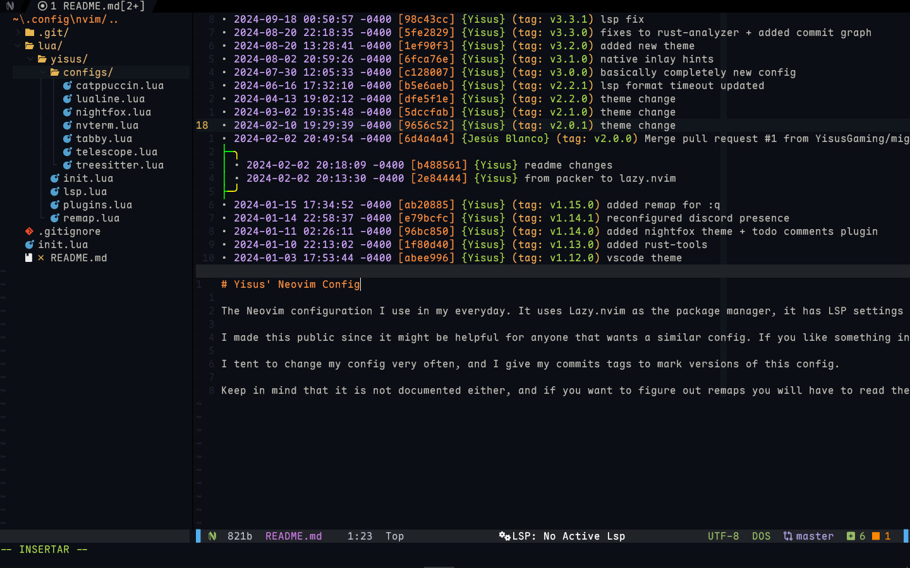
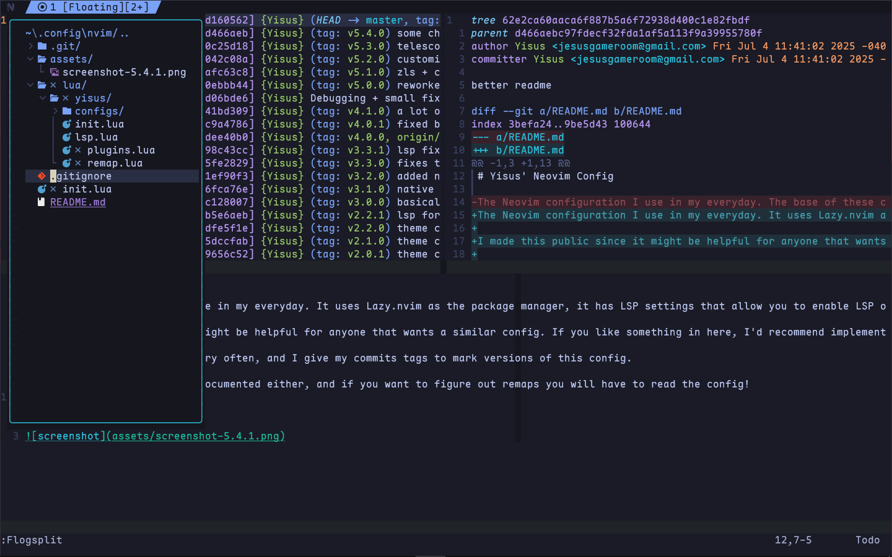

# Yisus' Neovim Config

The Neovim configuration I use in my everyday. It uses Lazy.nvim as the package manager, it has LSP settings that allow you to enable LSP only when you need it, tabs to handle multiple files, fuzzy finding, git flogs, file explorer, integrated terminal, and many other plugins and cool remaps.

I made this public since it might be helpful for anyone that wants a similar config. If you like something in here, I'd recommend implementing it in your existing config. If you want to clone this repo and use the entire thing, you should pick a tag that you like the most.

I tent to change my config very often, and I give my commits tags to mark versions of this config.

Keep in mind that it is not documented either, and if you want to figure out remaps you will have to read the config!

# Screenshots
Tag: v5.4.1

Tag: v5.5.0

